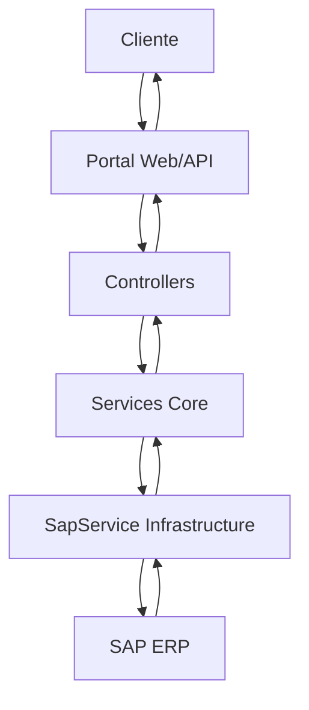

# 🏢 Portal Cliente Esgas

<div align="center">


**Sistema web moderno para consulta de faturas e gestão de clientes de gás**

[Funcionalidades](#-funcionalidades) • [Instalação](#-instalação) • [Uso](#-como-usar) • [API](#-api) • [Arquitetura](#-arquitetura)

</div>

---

## 📋 Sobre o Projeto

O **Portal Cliente Esgas** é uma aplicação web completa desenvolvida em .NET 8 que oferece aos clientes da empresa de gás uma interface moderna e intuitiva para:

- 🔍 **Consultar faturas** - Visualização detalhada de faturas e histórico
- 📄 **Download de PDFs** - Acesso rápido aos documentos fiscais
- 🔐 **Autenticação segura** - Login com CPF/CNPJ e número do cliente
- 📱 **Interface responsiva** - Compatível com dispositivos móveis
- 🔄 **Integração SAP** - Dados em tempo real do sistema ERP

## ✨ Funcionalidades

### 🌐 Portal Web (MVC)
- ✅ Autenticação por cookies com sessão de 1 hora
- ✅ Dashboard com lista de faturas do cliente
- ✅ Download direto de PDFs das faturas
- ✅ Interface responsiva com Bootstrap 5
- ✅ Notificações toast para feedback do usuário
- ✅ Validação de formulários com FluentValidation

### 🚀 API REST
- ✅ Autenticação JWT para integração com sistemas externos
- ✅ Endpoints para consulta de faturas
- ✅ Documentação automática com Swagger
- ✅ Rate limiting e CORS configurável
- ✅ Health checks para monitoramento

### 🏗️ Infraestrutura
- ✅ Logging estruturado com Serilog
- ✅ Tratamento global de exceções
- ✅ HttpClientFactory para performance otimizada
- ✅ Configurações externalizadas
- ✅ Arquitetura em camadas bem definida

## 🛠️ Tecnologias Utilizadas

### Backend
- **.NET 8** - Framework principal
- **ASP.NET Core MVC** - Interface web
- **ASP.NET Core Web API** - Serviços REST
- **Entity Framework Core** - ORM (futuro)
- **Serilog** - Logging estruturado
- **FluentValidation** - Validação de dados
- **WireMock.Net** - MockServer para desenvolvimento

### Frontend
- **Bootstrap 5** - Framework CSS
- **jQuery** - Interatividade
- **Font Awesome** - Ícones
- **Toastr** - Notificações

### Integrações
- **SAP ERP** - Sistema de gestão empresarial
- **HTTP Client** - Comunicação com APIs externas

## 🚀 Instalação

### Pré-requisitos
- [.NET 8 SDK](https://dotnet.microsoft.com/download/dotnet/8.0)
- [Visual Studio 2022](https://visualstudio.microsoft.com/) ou [VS Code](https://code.visualstudio.com/)
- Acesso à rede do servidor SAP

### Passo a passo

1. **Clone o repositório**
   ```bash
   git clone https://github.com/seu-usuario/PortalClienteEsgas.git
   cd PortalClienteEsgas
   ```

2. **Restaure as dependências**
   ```bash
   dotnet restore
   ```

3. **Configure as variáveis de ambiente** (opcional)
   ```bash
   # Para desenvolvimento local, edite appsettings.Development.json
   cp PortalCliente/appsettings.json PortalCliente/appsettings.Development.json
   ```

4. **Execute a aplicação**

   **Portal Web:**
   ```bash
   cd PortalCliente
   dotnet run
   # Acesse: https://localhost:7187
   ```

   **API:**
   ```bash
   cd PortalClienteAPI
   dotnet run
   # Acesse: https://localhost:7044/swagger
   ```

## 🧪 MockServer para Desenvolvimento

Para facilitar o desenvolvimento local sem dependência da API SAP externa, foi implementado um **MockServer** usando **WireMock.Net**.

### 🚀 Ativação do MockServer

**1. Configure o `appsettings.Development.json`:**
```json
{
  "SapService": {
    "BaseUrl": "http://localhost:8080/sap/bc/inbound/",
    "Username": "mock",
    "Password": "mock",
    "UseMock": true
  }
}
```

**2. Execute a aplicação:**
```bash
cd PortalCliente
dotnet run
```

O MockServer será iniciado automaticamente em `http://localhost:8080` quando:
- Environment = Development
- `SapService:UseMock = true`

### 📋 Dados Mock Disponíveis

**Cliente de teste:**
- **Código**: 12345
- **Nome**: Cliente Teste Mock
- **Token**: mock-token-123456789

**Faturas mockadas:**
```json
[
  {
    "document": "DOC001",
    "invoiceNumber": "INV001",
    "value": "150.75",
    "dueDate": "2024-02-15",
    "status": "Em aberto",
    "invoiceStatus": "PENDENTE"
  },
  {
    "document": "DOC002",
    "invoiceNumber": "INV002",
    "value": "89.50",
    "dueDate": "2024-03-15",
    "status": "Vencida",
    "invoiceStatus": "VENCIDA"
  },
  {
    "document": "DOC003",
    "invoiceNumber": "INV003",
    "value": "205.25",
    "dueDate": "2024-04-15",
    "status": "Paga",
    "invoiceStatus": "PAGA"
  }
]
```

### 🔄 Endpoints Mock Implementados

| Endpoint | Método | Descrição |
|----------|---------|-----------|
| `/sap/bc/inbound/DATAGAS003` | POST | Autenticação mock |
| `/sap/bc/inbound/DATAGAS004` | GET | Lista de faturas mock |
| `/sap/bc/inbound/DATAGAS005` | GET | Conteúdo da fatura mock |

### ⚙️ Alternar entre Mock e API Real

**Para usar a API real SAP:**
```json
{
  "SapService": {
    "BaseUrl": "http://srv-sap-prd.esgas.com.br:8000/sap/bc/inbound/",
    "Username": "DATAGAS",
    "Password": "Datagas@2023",
    "UseMock": false
  }
}
```

### 💡 Vantagens do MockServer

- ✅ **Desenvolvimento offline** - Não precisa de conexão com SAP
- ✅ **Dados controlados** - Responses previsíveis para testes
- ✅ **Performance** - Responses instantâneos
- ✅ **Debugging** - Logs detalhados das requisições
- ✅ **Flexibilidade** - Fácil alternância mock ↔ real

## 🎯 Como Usar

### 1. Acesso ao Portal Web

1. Navegue para `https://localhost:7187`
2. Faça login com:
   - **Username**: CPF (11 dígitos) ou CNPJ (14 dígitos)
   - **Password**: Número do cliente
3. Visualize suas faturas na dashboard
4. Clique em "Download" para baixar o PDF da fatura

### 2. Usando a API

**Autenticação:**
```bash
curl -X POST "https://localhost:7044/api/auth" \
  -H "Content-Type: application/json" \
  -d '{
    "clientNumber": "12345",
    "cpf": "12345678901",
    "cnpj": ""
  }'
```

**Consultar faturas:**
```bash
curl -X GET "https://localhost:7044/api/invoices" \
  -H "Authorization: Bearer SEU_JWT_TOKEN"
```

## 📚 API

### Endpoints Principais

| Método | Endpoint | Descrição |
|--------|----------|-----------|
| `POST` | `/api/auth` | Autenticação de cliente |
| `GET` | `/api/invoices` | Lista faturas do cliente |
| `GET` | `/api/invoices/{id}` | Detalhes de uma fatura |
| `GET` | `/health` | Health check da API |

### Exemplos de Resposta

**Autenticação bem-sucedida:**
```json
{
  "clientCode": "12345",
  "clientName": "João Silva",
  "token": "eyJhbGciOiJIUzI1NiIsInR5cCI6IkpXVCJ9..."
}
```

**Lista de faturas:**
```json
{
  "invoices": [
    {
      "document": "001",
      "invoiceNumber": "123456",
      "value": "R$ 89,50",
      "dueDate": "2024-01-15",
      "status": "Pendente",
      "barcodeNumber": "123456789012345678901234567890123456789012345"
    }
  ]
}
```

## 🏗️ Arquitetura

### Estrutura do Projeto

```
📁 PortalClienteEsgas/
├── 📁 PortalCliente/                 # Aplicação MVC Web
│   ├── 📁 Controllers/               # Controllers MVC
│   ├── 📁 Views/                     # Views Razor
│   ├── 📁 Services/                  # MockSapServer
│   ├── 📁 wwwroot/                   # Arquivos estáticos
│   └── 📁 Middleware/                # Middlewares customizados
├── 📁 PortalClienteAPI/              # Web API REST
│   ├── 📁 Controllers/               # Controllers API
│   ├── 📁 Services/                  # Serviços da API
│   └── 📁 Middleware/                # Middlewares da API
├── 📁 PortalCliente.Core/            # Camada de Domínio
│   ├── 📁 Dtos/                      # Data Transfer Objects
│   ├── 📁 Interfaces/                # Contratos de serviços
│   ├── 📁 Services/                  # Lógica de negócio
│   ├── 📁 Validators/                # Validações
│   └── 📁 Configuration/             # Classes de configuração
└── 📁 PortalCliente.Infrastructure/  # Camada de Infraestrutura
    └── 📁 Services/                  # Implementações concretas
```

### Fluxo de Dados



### Padrões Utilizados

- **🏛️ Arquitetura em Camadas** - Separação clara de responsabilidades
- **🔄 Dependency Injection** - Inversão de controle nativa do .NET
- **🎭 Repository Pattern** - Abstração da camada de dados
- **📋 DTO Pattern** - Transfer de dados entre camadas
- **🔧 Options Pattern** - Configurações tipadas e validadas
- **🏭 Factory Pattern** - HttpClientFactory para eficiência

## ⚙️ Configuração

### appsettings.json

```json
{
  "SapService": {
    "BaseUrl": "http://srv-sap-prd.esgas.com.br:8000/sap/bc/inbound/",
    "Username": "DATAGAS",
    "Password": "Datagas@2023",
    "SapClient": "600",
    "TimeoutSeconds": 30,
    "Endpoints": {
      "Authentication": "DATAGAS003",
      "GetInvoices": "DATAGAS004",
      "GetInvoiceContent": "DATAGAS005"
    }
  },
  "Jwt": {
    "SecretKey": "your-secret-key-here",
    "ExpirationHours": 1
  }
}
```

### Variáveis de Ambiente (Produção)

```bash
ASPNETCORE_ENVIRONMENT=Production
SAP_SERVICE_USERNAME=your_username
SAP_SERVICE_PASSWORD=your_password
JWT_SECRET_KEY=your_jwt_secret
```

## 📊 Monitoramento e Logs

### Serilog Configuration

Os logs são escritos em:
- **Console** - Para desenvolvimento
- **Arquivos** - `logs/portal-cliente-{date}.txt`

### Health Checks

- **URL**: `/health`
- **Monitora**: API, SAP connectivity, dependências

### Métricas

- Tempo de resposta das requisições SAP
- Taxa de sucesso de autenticações
- Número de downloads de faturas

## 🔐 Segurança

### Implementado
- ✅ Autenticação JWT para API
- ✅ Autenticação por cookies para web
- ✅ Validação de entrada rigorosa
- ✅ Logs de auditoria
- ✅ HTTPS obrigatório em produção

### Recomendações Adicionais
- 🔄 Implementar rate limiting
- 🔄 Adicionar CAPTCHA no login
- 🔄 Configurar CSP headers
- 🔄 Implementar 2FA

## 🤝 Contribuindo

1. Faça um fork do projeto
2. Crie uma branch para sua feature (`git checkout -b feature/MinhaFeature`)
3. Commit suas mudanças (`git commit -m 'Add: Nova funcionalidade'`)
4. Push para a branch (`git push origin feature/MinhaFeature`)
5. Abra um Pull Request

## 📝 Convenções

### Git Commits
- `feat:` - Nova funcionalidade
- `fix:` - Correção de bug
- `docs:` - Documentação
- `style:` - Formatação
- `refactor:` - Refatoração
- `test:` - Testes
- `chore:` - Tarefas de manutenção

### Código
- Siga as convenções do C#/.NET
- Use nomes em inglês para código
- Mantenha métodos pequenos e focados
- Documente APIs públicas

## 📄 Licença

Este projeto está sob a licença MIT. Veja o arquivo [LICENSE](LICENSE) para mais detalhes.

---

<div align="center">

**Desenvolvido com ❤️ usando .NET 8 e boas práticas de desenvolvimento**

[⬆️ Voltar ao topo](#-portal-cliente-esgas)

</div>